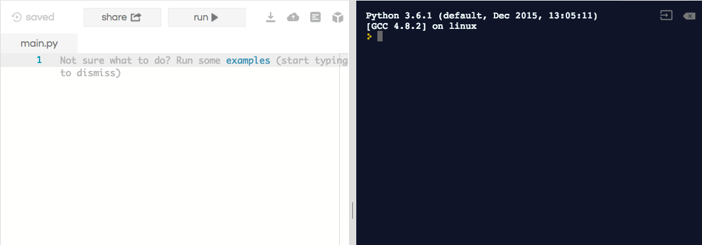

## What you will need

You’re going to need **Python**! You can either use Python online in a web browser, or download and install it on your computer. Select the right option for you below, and follow the instructions.

--- collapse ---
---
title: I will use a web browser to work online
---

+ Go to [repl.it](https://repl.it){:target="blank"} and search for 'Python 3'.

The editor looks like this:



On the left is where you write all your code. On the right is the console, where the code runs.

To run the code, you click the **Run** button.

+ If you want to save your projects, you can sign up for an account and log in.

--- /collapse ---

--- collapse ---
---
title: I will install Python on my computer
---

Before you can start coding, you'll need to set up your computer to write Python. You'll need to have Python and a text editor installed, and know how to run a Python program.

+ To install Python, go to [dojo.soy/py-setup](http://dojo.soy/py-setup){:target="blank"} and click on the **Download Python 3** button. There will be some other numbers after the **3**, but they change too often for me to include them. Don't worry about them.

+ Once the installer has downloaded, start it and click through it, accepting the default choices.

+ Now you need to get a text editor to write your Python code with. We recommend Atom, which you can download [here](http://atom.io){:target="blank"}, but you can use another editor if you're more familiar with it or just like it better.

+ Once you have both of these set up, you're ready to go. You just need to make sure that everything is working and that you know how to run a Python program. Follow these steps:
 1. Make a new folder for your Python Sushi Cards projects.
 2. Open your text editor and create a new file. Save it into the folder you just made and call it **beginner_sushi.py**.
 3. Open a command line window on your computer (called **command prompt** on Windows and **Terminal** on Mac) and navigate to your folder using the `cd` command (ask a mentor for help if you don't know how to do this, or see below).
 4. Once you're in your folder in the command line, you're ready to try running the blank file you just created by typing this command into the command line:
  ```bash
  python3 beginner_sushi.py
  ```
  If this has worked, you shouldn't see any messages when you run the command.

### Running a program
In later cards, you'll be asked to **run** a program.

What that means is what you've just done: getting to the folder that has the program file in it and using the `python3` command and its name to make the program do its thing!

+ Whenever you make any changes to your code, you will need to **save** the file before running it.

--- /collapse ---


--- collapse ---
---
title: I'm installing Python on my computer, and I don't know how to use the command line!
---

To navigate to a folder on the command line, you'll first need to know the **path** to that folder.

A path looks something like this: `/Users/ciara/Documents/sushiProjects/`. Each bit of text between the `/` symbols is a folder, and everything after it is inside that folder.

How you find out what the path is will vary depending on your computer, but you can find it by opening the folder you made in a file explorer.

Once you have the path, you use it with the `cd` command to navigate to the folder in a command line window. To run a command in the command line, you need to press the <kbd>Return</kbd> key once you've typed it in.

Here's how the command looks for my example:

```bash
cd /Users/ciara/Documents/sushiProjects/
```

Here I'm navigating to the `sushiProjects` folder, which I created inside the `Documents` folder.

Ask a mentor for help if you need it!

--- /collapse ---

